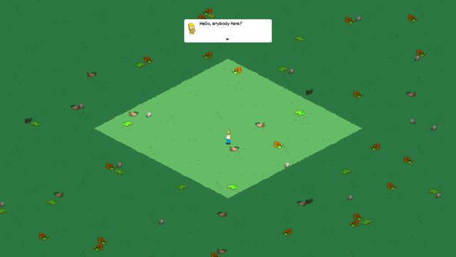
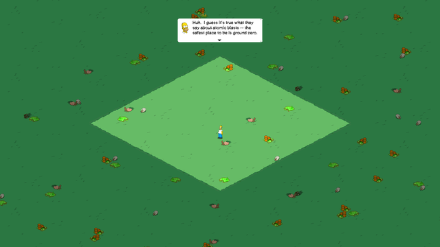
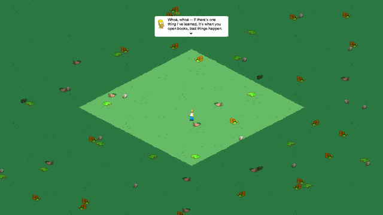

# tstorecomp

> *The Simpsons: Tapped Out* as a native cross-platform desktop application —
> with the server built into the app as a loopback sidecar, not bolted on
> beside it.


**Status: it runs the tutorial.** One `run-tsto.bat` boots the engine,
authenticates against the loopback sidecar, installs the DLC the client asks
for, loads a new-player town, and drops you into the first mission — Springfield
has just been levelled, Homer is standing alone in the crater, and the opening
script advances on input. Every frame below is recompiled ARM64 code on an
x86-64 desktop: no emulator, no Android runtime, no APK at runtime.

|  |  |  |
|---|---|---|
| Arrival — the debris to clear, and the 2×2 block of land a new player owns. | The script runs: "the safest place to be is ground zero". | Input advances it, line by line, into the quest chain. |

**770 of 776 imports resolve** — 656 from the host, 114 from the libraries the
APK ships beside the engine, and the last six are `libOpenSLES` interface IDs.
The lifter covers **99.93% of instructions**, `arc_boot` runs **all 1,527 static
constructors with no faults**, and mouse input is forwarded as touch. See
[Milestones](#milestones) and [Known issues](#known-issues).

Twenty-seven of those constructors were won without touching this port at all.
They came from [fgrecomp](https://github.com/sp00nznet/fgrecomp), the sibling
port on the same kit: a second, unrelated engine surfaced a shim bug and a
whole class of missing function boundaries that this engine had been quietly
suffering from too. That is the argument for
[androidrecomp](https://github.com/sp00nznet/androidrecomp) being a separate
repository, made concrete.

---

## What this is

TSTO is not a Java game. Everything that matters — the renderer, the
simulation, the isometric town — lives in a single 28 MB ARM64 shared object
(`libscorpio.so`, Bight Games' *Scorpio* engine). The Java side is a 14-method
JNI bridge that owns a window, a GL context, and a touch handler. Nothing else.

So this is a port, not an emulator: replace the Android host with a native
desktop host, satisfy the library's small POSIX/OpenGL import surface, and lift
the ARM64 code to C for machines that are not ARM.

It is also more than a port. EA's servers went dark in January 2025, so the
client needs one regardless; folding a local server *into the binary* is the
difference between a technical exercise and something worth running. The goal is
a single desktop app that boots into your Springfield.

## This repo is the thin half

The loader, the Bionic/Android shim layer, the host window and the triage tools
are not specific to this game, and they live in
**[androidrecomp](https://github.com/sp00nznet/androidrecomp)**, vendored here as
a submodule. That separation was made early on purpose: extracting a reusable
kit *after* a port has grown into it is painful and rarely happens.

What remains here is what is genuinely about this title:

```
tstorecomp/
├── androidrecomp/          # submodule -- loader, shims, window, tools
├── server/                 # submodule -- the loopback sidecar server
├── contract/bgcore.txt     # the 15 JNI entry points the host drives
├── run-tsto.bat.example    # the boot order, annotated -- see Running it
├── install_dlc.py          # install the packs the client asked for
├── dlc_index_filter.py     # edit the DLC index the client reads
├── make_tutorial_town.py   # derive a new-player town from a played one
├── docs/                  # architecture, triage, screenshots
│   ├── ARCHITECTURE.md
│   └── triage-libscorpio-arm64.md
└── CMakeLists.txt
```

The three scripts are the title-specific half of getting into the town, and
each one exists because the client would not do it for us:

- **`install_dlc.py`** — the engine does not treat DLC as optional. It
  `fopen`s `<assets>/dlc/<group>/<pack>/0` for every pack its index names, and
  a pack that is not there is not an empty pack to this engine; it is a pointer
  field left at −1. A run with `ARC_TRACE_FILES=1` logs one line per pack it
  looked for and did not find, so the log *is* the install list — more reliable
  than re-deriving it from the index, because it is what this build, at this
  version, on this flavour, actually wanted.
- **`dlc_index_filter.py`** — the only durable way to take a pack away. Packs
  held back on disk reinstall themselves: the client compares the index against
  what it has and downloads the difference. Removing the `<Package>` element
  is what sticks. The per-pack CRCs and signatures belong to the files, not to
  the index, so the survivors stay valid.
- **`make_tutorial_town.py`** — a new-player town by subtraction. Superseded in
  practice by a genuine square-one save, and kept because the subtraction is
  what taught us which fields the client will not accept as absent.

## Legal / content policy

Tools only. No game code, no game assets, no extracted sprites, no save data, no
EA binaries — `.gitignore` blocks all of it, deliberately. You supply your own
legally obtained APK; everything here operates on a file you already have.
Licensed MIT; contributions must be your own work.

## Building

```sh
git clone --recursive https://github.com/sp00nznet/tstorecomp
cmake -S . -B build -DCMAKE_BUILD_TYPE=Release
cmake --build build

./build/tsto_host --contract=contract/bgcore.txt path/to/libscorpio.so
./build/tsto_host --window --contract=contract/bgcore.txt path/to/libscorpio.so
```

On Windows add `-DCMAKE_TOOLCHAIN_FILE=C:/vcpkg/scripts/buildsystems/vcpkg.cmake`
so CMake finds zlib and SDL2. A toolchain file only takes effect on a fresh
cache, so delete `build/` if you add it later.

Point it at the `lib/arm64-v8a/` directory of an extracted APK — the loader uses
the libraries sitting next to the engine to satisfy its imports.

`tsto_host` is the triage build: it maps the engine and tells you what it still
needs. It does not run the game.

## Running it

Playing the game is the *lifted* build — `arc_boot`, from
[androidrecomp](https://github.com/sp00nznet/androidrecomp), linked against the
C the lifter produced from `libscorpio.so`. Three things have to be up:

1. **The sidecar.** `python tsto_server.py` in `server/`, listening on
   `127.0.0.1:9000`. `server/config.json` names the town it serves.
2. **The assets.** An extracted APK under `work/assets`, plus the DLC packs the
   client asks for — see `install_dlc.py` above.
3. **The boot order**, which is Android's and is not optional: the GL surface
   before the engine boots, `ScorpioJNI_init`, then the activity lifecycle, then
   a tap to leave the title.

`run-tsto.bat.example` is that launcher. Set `ARC_ROOT` and `WORK` at the top
and it runs as-is; every step in it carries the comment explaining what breaks
without it, which is the part worth reading.

```sh
copy run-tsto.bat.example run-tsto.bat
run-tsto.bat --frames=420 --shot=town.ppm      # boot, play 420 frames, capture
```

The screenshots at the top of this file were taken that way, with extra taps at
`--entry-at=frame:N` to advance the tutorial dialogue.
[BOOTING](https://github.com/sp00nznet/androidrecomp/blob/main/docs/BOOTING.md)
in androidrecomp is the general version of the same problem.

## What the target looks like

Measured against a stock 4.69.x `arm64-v8a` build
([full triage report](docs/triage-libscorpio-arm64.md)):

| | |
|---|---|
| `.text` | 19.8 MB, 4,940,609 instructions, 707 distinct mnemonics |
| Functions recovered from `.eh_frame` | **62,008**, covering **98.8%** of `.text` |
| Relocations | 98,172, in only 4 types, and **no TLS segment** |
| Static constructors | 1,527 |
| JNI entry points | 73 (the whole game loop is 14 of them) |
| Indirect branches (`br`/`blr`) | 103,969 |
| Exclusives / LSE atomics | 11,512 / 42 |
| `svc` / `mrs`,`msr` | 115 / 1,571 |

Near-total `.eh_frame` coverage removes the single hardest problem in static
recompilation — function boundary recovery is guesswork on a stripped console
binary, and here it is read straight out of the unwind tables. The 104k indirect
branches are C++ vtable dispatch and are the real work, but with 62k known
function starts they reduce to an address → function-pointer table.

## Import surface

Across the engine and the three libraries the APK ships beside it: **776
imports, 770 resolved, 6 outstanding.**

The six are `libOpenSLES` interface IDs, reached only through the shipped
`libopenal.so` — its audio backend is Android's. They go when native openal-soft
replaces it, which is the one library worth replacing rather than loading.

Getting there turned on a few findings worth keeping:

- **`libEGL.so` and `libNimble.so` import nothing at all.** Both sit in
  `DT_NEEDED`, but EGL context creation happened on the Java side, and the
  host's windowing library makes the GL context anyway. Neither needs a *shim* —
  which is not the same as neither mattering. Nimble (EA's identity/telemetry/IAP
  SDK) turned out to be called into by the engine's own static constructors, not
  only from Java, and since it is ARM code like any other it has to be lifted
  rather than merely mapped. Three constructors trapped on that until it was.
- **libc++ solved itself.** Its 114 NDK-mangled (`_ZNSt6__ndk1...`) symbols
  cannot come from any host STL — but the APK ships `libc++_shared.so`, so the
  loader loads it and uses it.
- **GL cost nothing.** A desktop GL 2.1 compatibility context exports every
  GLES2 and GLESv1_CM entry point the engine imports, under identical names, so
  all 50 bind straight through the driver with no wrappers.
- **File I/O could not be forwarded.** Bionic's `O_CREAT` is 0100 where the
  Microsoft CRT's is 0x100, and `struct stat` and `struct dirent` have layouts of
  their own — so those are written field by field at Bionic's offsets.
- **`dl_iterate_phdr` matters more than it looks.** It is how the C++ unwinder
  finds each image's `.eh_frame`, so guest exceptions do not unwind without it.

## Milestones

- [x] **M0 — Triage.** Measure the target.
- [x] **M1 — Loader.** Map, relocate, bind, protect; verify the host contract.
- [x] **M2 — Shim + window.** **770 of 776 imports resolved**, an SDL2
      window with a live GL context, and a JNI bridge the engine calls back
      through. `--loop` renders, presents and forwards mouse events as touch.
      The OpenAL surface the engine actually calls is implemented; what is left
      is the six `libOpenSLES` interface IDs behind the shipped
      `libopenal.so`, which go when native openal-soft replaces it.
- [x] **M3 — Lifter.** ARM64 → C. **99.94% of instructions**, across 70,688
      functions in three images — the engine and the C++ runtime the APK ships
      beside it, because a call into that runtime lands in ARM code like any
      other. Boundaries come from `.eh_frame`, the PLT, call sites and the gaps
      between them, which between them leave *no* undescribed call target
      standing in as a stub. Verified against Unicorn rather than arm64
      hardware. `arc_boot` runs all 1,527 static constructors with no traps
      and no faults; the last three needed libNimble's `JNI_OnLoad` called
      before them, which is what Android does and the kit now does too.
- [x] **M4 — x86-64 Windows.** The lifted engine runs, renders and takes input
      on x86-64. Linux and macOS come from the same C and are untested.
- [x] **M5 — Into the town.** The sidecar answers the boot, the DLC installs,
      a new-player save loads, and the tutorial runs. Four things had to be
      true at once, and each was its own bug: the DLC had to be installed
      rather than merely offered; every float-taking import had to stop going
      through the integer bridge; `struct tm` had to be Bionic's, not the
      host's; and the save had to be one a real client wrote — every town
      assembled or edited by hand was rejected.
- [ ] **M6 — Playable.** The quest chain, the HUD, and the seasonal-content
      bug below. See [Known issues](#known-issues).

On an arm64 host — Apple Silicon, Windows-on-ARM, arm64 Linux — the engine's
instructions execute natively, so the shim and the bridge are the whole job,
with no lifting involved.

## Known issues

- **The engine draws winter precipitation over the town.** About 20,500
  sprite quads a frame — `PrecipitationInstance` / `TimedPrecipitationInstance`
  through `BGSceneSpriteArrayNode`, declared in `FlyBys.xml` and shipped in the
  winter DLC packs — which whites out the map. The game underneath is intact
  and playable; the layer just covers it.

  A reference client on the same sidecar, the same save and the same pack set
  draws none of it, so this is ours. Ruled out by measurement: the clock (every
  date the engine breaks down is a sane past window), the sidecar's
  `gameplayconfig` and `protoClientConfig`, the save, land ownership, the pack
  set, the length of the pack-mount walk, the asset tier's content, and the
  client build itself — the reference's `libscorpio.so` differs from ours in 76
  bytes, all of them one patched DLC host string. The count is *byte-identical*
  at 28,560 draws across every configuration that shows it, which is what
  places it as a fixed particle system rather than anything scene-derived.

  Workaround, until the gate is found:

  ```sh
  python dlc_index_filter.py --exclude XMAS --exclude Christmas --exclude Winter
  ```

  then move `work/assets/dlc/*XMAS*` aside and remove `dlcindexcodesave` so the
  index is read again. `--restore` puts the index back.

- **The asset tier is stuck at the lowest.** We ask the server for `-25`
  textures and `-iphone` menus where a device at the same 1280×720 resolves to
  `-50`/`retina`. The engine takes a "forced asset tier" field as authoritative
  unless it reads −1; ours reads 0, so its own screen-size decision never runs
  and 0 maps to the bottom tier. Cosmetic today, and a real initialisation bug.

- **The HUD is created but not drawn.** `MenuManager` reports
  `eMenu_MainHUD`, `eMenu_HUDSidebar`, `eMenu_BottomButtons` and
  `eMenu_ToolMenu`; none of them reach the screen. Dialogue boxes do.

- **Three knobs are load-bearing.** `ARC_LEAK_FREE`, `ARC_PURE_VIRTUAL=skip`
  and `ARC_JNI_ABSENT` each paper over a real defect, and clearing any of them
  ends the run before the town. `run-tsto.bat` documents what each one hides
  and takes `ARC_NO_*` to turn it off for a run.

## The server

The app should not need a container, a LAN, or anything outside the process. The
game speaks plain HTTP to a configurable base URL, so the server runs **inside
the app as a loopback sidecar** — started on `127.0.0.1` at launch, shut down on
exit. Nothing leaves the machine.

A sidecar process rather than a linked-in library, for two reasons: it reuses
~2,000 lines of working protocol code with no rewrite, and it keeps a clean
licence boundary. Upstream
[`d-fens/tsto_server`](https://github.com/d-fens/tsto_server) states no licence
at all, so its code cannot be vendored into an MIT repository or linked into an
MIT binary. A submodule references it without redistributing it, and a separate
process is not a derivative work.

`server/` points at
[`sp00nznet/tsto-springfield`](https://github.com/sp00nznet/tsto-springfield),
our fork with the boot-loop and persistence fixes. It used to serve an isometric
web view of your town as well; that is gone, because the client draws
Springfield itself now, from the same art, at the frame rate the engine draws it
at. What is left there is protocol and configuration.

On Android the server URL has to be patched into `libscorpio.so` by hash and
offset. In a native build it is just a config value — which also removes the
"clean APK only" constraint the Android patcher has.

## Credits

*The Simpsons: Tapped Out* is © Electronic Arts. This project is not affiliated
with or endorsed by EA, Bight Games, or Fox. It ships no EA code or content.
