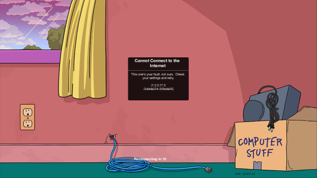

# tstorecomp

> *The Simpsons: Tapped Out* as a native cross-platform desktop application —
> with the server built into the app as a loopback sidecar, not bolted on
> beside it.


**Status: it boots.** The engine's own splash, then its real UI. The state
machine runs `LoadingState`, `RebuildTextureTask` and `ReachabilityTask`, finds
no server, and draws its own "Cannot Connect to the Internet" screen with a
reconnect countdown — the correct behaviour for a game whose servers are gone,
rendered entirely by recompiled ARM64 code with no emulator and no Android
runtime.



**770 of 776 imports resolve** — the last six are the audio backend. The lifter
covers **99.93% of instructions**, `arc_boot` runs **all 1,527 static
constructors with no faults**, and mouse input is forwarded as touch. What
remains is the server. See [Milestones](#milestones).

Twenty-seven of those constructors were won without touching this port at all.
They came from [fgrecomp](https://github.com/sp00nznet/fgrecomp), the sibling
port on the same kit: a second, unrelated engine surfaced a shim bug and a
whole class of missing function boundaries that this engine had been quietly
suffering from too. That is the argument for
[androidrecomp](https://github.com/sp00nznet/androidrecomp) being a separate
repository, made concrete.

---

## What this is

TSTO is not a Java game. Everything that matters — the renderer, the
simulation, the isometric town — lives in a single 28 MB ARM64 shared object
(`libscorpio.so`, Bight Games' *Scorpio* engine). The Java side is a 14-method
JNI bridge that owns a window, a GL context, and a touch handler. Nothing else.

So this is a port, not an emulator: replace the Android host with a native
desktop host, satisfy the library's small POSIX/OpenGL import surface, and lift
the ARM64 code to C for machines that are not ARM.

It is also more than a port. EA's servers went dark in January 2025, so the
client needs one regardless; folding a local server *into the binary* is the
difference between a technical exercise and something worth running. The goal is
a single desktop app that boots into your Springfield.

## This repo is the thin half

The loader, the Bionic/Android shim layer, the host window and the triage tools
are not specific to this game, and they live in
**[androidrecomp](https://github.com/sp00nznet/androidrecomp)**, vendored here as
a submodule. That separation was made early on purpose: extracting a reusable
kit *after* a port has grown into it is painful and rarely happens.

What remains here is what is genuinely about this title:

```
tstorecomp/
├── androidrecomp/          # submodule -- loader, shims, window, tools
├── server/                 # submodule -- the loopback sidecar server
├── contract/bgcore.txt     # the 15 JNI entry points the host drives
├── docs/                  # architecture, triage, the screenshot
│   ├── ARCHITECTURE.md
│   └── triage-libscorpio-arm64.md
└── CMakeLists.txt
```

At the moment that is one text file — which is exactly the point. The JNI
bridge, the asset layout and the server integration land here next.

## Legal / content policy

Tools only. No game code, no game assets, no extracted sprites, no save data, no
EA binaries — `.gitignore` blocks all of it, deliberately. You supply your own
legally obtained APK; everything here operates on a file you already have.
Licensed MIT; contributions must be your own work.

## Building

```sh
git clone --recursive https://github.com/sp00nznet/tstorecomp
cmake -S . -B build -DCMAKE_BUILD_TYPE=Release
cmake --build build

./build/tsto_host --contract=contract/bgcore.txt path/to/libscorpio.so
./build/tsto_host --window --contract=contract/bgcore.txt path/to/libscorpio.so
```

On Windows add `-DCMAKE_TOOLCHAIN_FILE=C:/vcpkg/scripts/buildsystems/vcpkg.cmake`
so CMake finds zlib and SDL2. A toolchain file only takes effect on a fresh
cache, so delete `build/` if you add it later.

Point it at the `lib/arm64-v8a/` directory of an extracted APK — the loader uses
the libraries sitting next to the engine to satisfy its imports.

## What the target looks like

Measured against a stock 4.69.x `arm64-v8a` build
([full triage report](docs/triage-libscorpio-arm64.md)):

| | |
|---|---|
| `.text` | 19.8 MB, 4,940,609 instructions, 707 distinct mnemonics |
| Functions recovered from `.eh_frame` | **62,008**, covering **98.8%** of `.text` |
| Relocations | 98,172, in only 4 types, and **no TLS segment** |
| Static constructors | 1,527 |
| JNI entry points | 73 (the whole game loop is 14 of them) |
| Indirect branches (`br`/`blr`) | 103,969 |
| Exclusives / LSE atomics | 11,512 / 42 |
| `svc` / `mrs`,`msr` | 115 / 1,571 |

Near-total `.eh_frame` coverage removes the single hardest problem in static
recompilation — function boundary recovery is guesswork on a stripped console
binary, and here it is read straight out of the unwind tables. The 104k indirect
branches are C++ vtable dispatch and are the real work, but with 62k known
function starts they reduce to an address → function-pointer table.

## Import surface

Across the engine and the three libraries the APK ships beside it: **776
imports, 770 resolved, 6 outstanding.**

The six are `libOpenSLES` interface IDs, reached only through the shipped
`libopenal.so` — its audio backend is Android's. They go when native openal-soft
replaces it, which is the one library worth replacing rather than loading.

Getting there turned on a few findings worth keeping:

- **`libEGL.so` and `libNimble.so` import nothing at all.** Both sit in
  `DT_NEEDED`, but EGL context creation happened on the Java side, and the
  host's windowing library makes the GL context anyway. Neither needs a *shim* —
  which is not the same as neither mattering. Nimble (EA's identity/telemetry/IAP
  SDK) turned out to be called into by the engine's own static constructors, not
  only from Java, and since it is ARM code like any other it has to be lifted
  rather than merely mapped. Three constructors trapped on that until it was.
- **libc++ solved itself.** Its 114 NDK-mangled (`_ZNSt6__ndk1...`) symbols
  cannot come from any host STL — but the APK ships `libc++_shared.so`, so the
  loader loads it and uses it.
- **GL cost nothing.** A desktop GL 2.1 compatibility context exports every
  GLES2 and GLESv1_CM entry point the engine imports, under identical names, so
  all 50 bind straight through the driver with no wrappers.
- **File I/O could not be forwarded.** Bionic's `O_CREAT` is 0100 where the
  Microsoft CRT's is 0x100, and `struct stat` and `struct dirent` have layouts of
  their own — so those are written field by field at Bionic's offsets.
- **`dl_iterate_phdr` matters more than it looks.** It is how the C++ unwinder
  finds each image's `.eh_frame`, so guest exceptions do not unwind without it.

## Milestones

- [x] **M0 — Triage.** Measure the target.
- [x] **M1 — Loader.** Map, relocate, bind, protect; verify the host contract.
- [x] **M2 — Shim + window.** **770 of 776 imports resolved**, an SDL2
      window with a live GL context, and a JNI bridge the engine calls back
      through. `--loop` renders, presents and forwards mouse events as touch.
      Left: audio.
- [x] **M3 — Lifter.** ARM64 → C. **99.94% of instructions**, across 70,688
      functions in three images — the engine and the C++ runtime the APK ships
      beside it, because a call into that runtime lands in ARM code like any
      other. Boundaries come from `.eh_frame`, the PLT, call sites and the gaps
      between them, which between them leave *no* undescribed call target
      standing in as a stub. Verified against Unicorn rather than arm64
      hardware. `arc_boot` runs all 1,527 static constructors with no traps
      and no faults; the last three needed libNimble's `JNI_OnLoad` called
      before them, which is what Android does and the kit now does too.
- [ ] **M4 — x86-64.** Windows first, Linux and macOS from the same C.

On an arm64 host — Apple Silicon, Windows-on-ARM, arm64 Linux — M2 is the last
milestone before the game runs: the engine's instructions execute natively, so
finishing the shim and the bridge is enough, with no lifting involved.

## The server

The app should not need a container, a LAN, or anything outside the process. The
game speaks plain HTTP to a configurable base URL, so the server runs **inside
the app as a loopback sidecar** — started on `127.0.0.1` at launch, shut down on
exit. Nothing leaves the machine.

A sidecar process rather than a linked-in library, for two reasons: it reuses
~2,000 lines of working protocol code with no rewrite, and it keeps a clean
licence boundary. Upstream
[`d-fens/tsto_server`](https://github.com/d-fens/tsto_server) states no licence
at all, so its code cannot be vendored into an MIT repository or linked into an
MIT binary. A submodule references it without redistributing it, and a separate
process is not a derivative work.

`server/` points at
[`sp00nznet/tsto-springfield`](https://github.com/sp00nznet/tsto-springfield),
our fork with the boot-loop and persistence fixes. It used to serve an isometric
web view of your town as well; that is gone, because the client draws
Springfield itself now, from the same art, at the frame rate the engine draws it
at. What is left there is protocol and configuration.

On Android the server URL has to be patched into `libscorpio.so` by hash and
offset. In a native build it is just a config value — which also removes the
"clean APK only" constraint the Android patcher has.

## Credits

*The Simpsons: Tapped Out* is © Electronic Arts. This project is not affiliated
with or endorsed by EA, Bight Games, or Fox. It ships no EA code or content.
